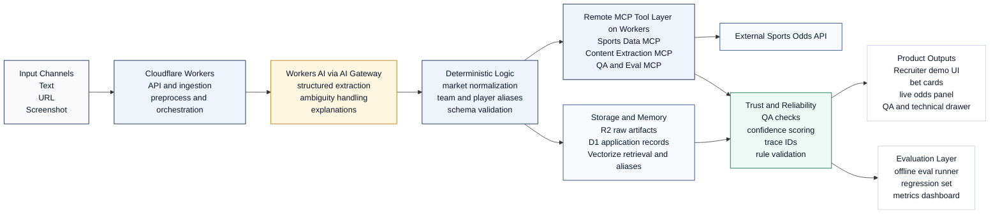

# BetCopilot AI

**AI-Powered Betting Intelligence**

BetCopilot AI is a production-minded applied AI system that transforms noisy betting language into structured, validated betting intelligence. The repository combines LLM extraction, deterministic normalization, odds enrichment, QA gating, evaluation workflows, and a polished recruiter-facing product experience on Cloudflare-native infrastructure.

## Why BetCopilot AI

- converts messy text, URL content, and screenshot-led workflows into structured bet candidates
- runs a multi-stage pipeline instead of a single prompt
- enriches extracted markets with live odds context through a provider abstraction
- exposes QA, confidence, latency, and trace metadata in a clean operator-facing interface
- demonstrates applied AI engineering, product judgment, and production reliability patterns in one repository

## Architecture Overview

BetCopilot AI runs as a Cloudflare-native intelligence pipeline: multimodal inputs enter a Worker-based ingestion layer, Workers AI handles structured extraction, deterministic logic normalizes entities and markets, remote MCP-style tools enrich with sports data, and QA plus evaluation layers make the system measurable and trustworthy.

GitHub renders Mermaid diagrams directly in markdown, so the architecture below is visible in the repository without extra tooling.



- multimodal inputs enter the platform through a Cloudflare Workers ingestion layer
- structured extraction runs on Cloudflare Workers AI with AI Gateway-ready observability
- remote MCP servers handle sports data, content extraction, QA, and evaluation tools
- deterministic normalization and schema validation reduce hallucination risk
- QA, confidence scoring, trace IDs, and offline evals make the system recruiter-visible and operator-friendly

BetCopilot AI is a multi-stage applied AI system that transforms noisy betting inputs into structured, validated intelligence. The system combines LLM-based extraction on Cloudflare Workers AI with deterministic normalization, tool-based market enrichment, and QA plus evaluation layers to produce reliable user-facing outcomes.

For a higher-fidelity export, see [the standalone SVG architecture asset](docs/images/betcopilot-architecture.svg) and [the detailed architecture doc](docs/solution-architecture.md).

## Product Experience

The recruiter demo is designed to feel like a modern AI product instead of a raw developer console.

- premium hero input flow with text, URL, and screenshot modes
- product-style result cards for extracted bets, odds enrichment, QA, explanation, and traceability
- visible technical trace area showing model provider, model name, pipeline stages, latency, and trace ID
- collapsible technical drawer for structured JSON and detailed trace metadata
- responsive layout that stacks cleanly on mobile for screenshots and portfolio use

## Key Capabilities

- schema-first extraction with support for multiple bet candidates from a single input
- rule-based normalization for sports, leagues, team aliases, player names, lines, and market labels
- odds provider abstraction with seeded demo coverage and a real provider adapter path
- QA and validation checks for ambiguity, missing fields, unsupported markets, unresolved events, and confidence thresholds
- offline evaluation suite with synthetic regression coverage and recruiter-friendly metric summaries
- Cloudflare Worker deployment model for edge orchestration and production-facing runtime patterns

## Screenshots

Place recruiter-facing screenshots in [`docs/images`](docs/images/README.md). Recommended filenames:

- `docs/images/demo-hero.png`
- `docs/images/demo-results.png`
- `docs/images/demo-eval.png`

Once added, they can be embedded here:

```md


```

## Demo Scenarios

These flows are tuned to render cleanly in the MVP demo and public showcase:

1. `LeBron over 27.5 points and Lakers moneyline tonight`
2. `Arsenal to win and both teams to score`
3. `Celtics -4.5 vs Heat`

BetCopilot AI presents:

- an extraction summary with pipeline status
- polished bet cards with confidence and QA state
- odds enrichment cards with provider context
- a trust module with warnings and validation chips
- a visible technical trace with model, latency, and stage timing

## Why This Maps To A Senior Applied AI Engineer Role

This repository demonstrates the blend of skills hiring managers usually want but rarely see together in one project:

- LLM systems design with structured outputs, retries, and schema validation
- deterministic post-processing instead of prompt-only reasoning
- tool-use architecture through remote MCP-style services
- production reliability patterns such as trace IDs, QA gating, and evaluation workflows
- edge and cloud architecture judgment using Cloudflare Workers, Workers AI, D1, R2, and Vectorize
- user-facing product thinking through a premium, mobile-friendly demo experience

## Local Run

1. Install dependencies:

   ```bash
   npm install
   ```

2. Start the API worker:

   ```bash
   npm run dev:api
   ```

3. Start the demo UI:

   ```bash
   npm run dev:ui
   ```

4. Open the UI:

   ```text
   http://127.0.0.1:4173
   ```

5. Optional public showcase API worker:

   ```bash
   cd apps/api-showcase
   npm run dev
   ```

## Recruiter Demo Guide

See [docs/recruiter-demo-guide.md](docs/recruiter-demo-guide.md) for a concise walkthrough, click path, talking points, and the three polished demo scenarios.

## Environment

See [`.env.example`](.env.example) for model, odds provider, and confidence threshold settings.

@BryteSikaStrategyAI
