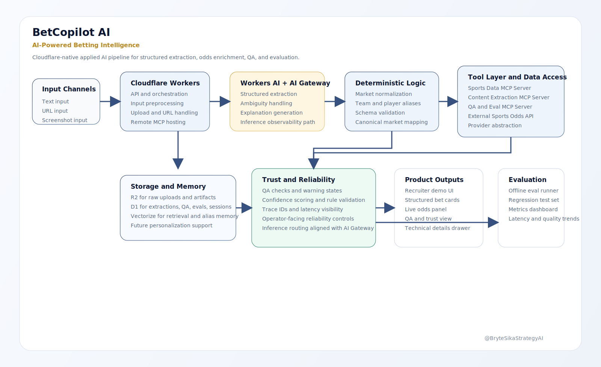
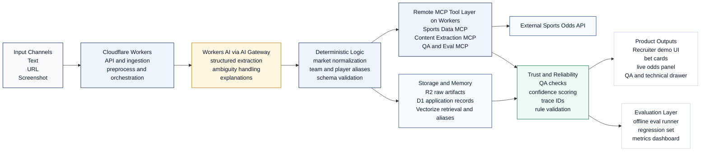

# Solution Architecture

## Overview

BetCopilot AI is a Cloudflare-native applied AI system that transforms messy betting inputs into structured, validated intelligence. The architecture combines multimodal ingestion, LLM-based extraction, deterministic normalization, remote MCP-style tools, real-time odds enrichment, QA controls, and offline evaluation in a single operating model.

## Mermaid Source

GitHub renders Mermaid diagrams directly inside markdown. The repository source for the architecture view lives in [images/betcopilot-architecture.mmd](images/betcopilot-architecture.mmd).

## Architecture Narrative

BetCopilot AI is a multi-stage applied AI system that transforms noisy betting inputs into structured, validated intelligence. The system combines LLM-based extraction on Cloudflare Workers AI with deterministic normalization, tool-based market enrichment, and QA plus evaluation layers to produce reliable user-facing outcomes.

## Layer Breakdown

### Input Channels

- text input from chat or pasted commentary
- URL-led ingestion for article and link workflows
- screenshot-led intake for bet slips and odds screens

### Cloudflare Workers Ingestion

Cloudflare Workers provides the primary API and orchestration layer. It accepts requests from the demo UI, normalizes source metadata, creates trace IDs, and coordinates downstream extraction, enrichment, and reporting.

### Workers AI Extraction

Workers AI handles structured extraction rather than free-form chat generation. The extraction stage is designed to identify supported betting entities, preserve ambiguity where evidence is weak, and produce explanation-ready outputs.

### Deterministic Logic

After extraction, deterministic logic standardizes sports, leagues, team aliases, player references, market labels, lines, and schema shape. This layer reduces hallucination risk and keeps downstream tool calls consistent.

### MCP Tool Layer

Remote MCP-style servers hosted on Cloudflare Workers encapsulate:

- Sports Data MCP Server
- Content Extraction MCP Server
- QA and Eval MCP Server

These services support event resolution, live odds lookup, article retrieval, market comparison, and evaluation execution. External sportsbook data remains behind a provider adapter so integrations stay swappable.

### Storage And Memory

- **R2** stores raw uploads and other bronze-layer artifacts
- **D1** stores structured application records such as extractions, QA outcomes, eval runs, and session metadata
- **Vectorize** supports retrieval-oriented use cases such as alias memory, embeddings, and future personalization

### Trust And Reliability

BetCopilot AI exposes reliability signals instead of hiding them. QA checks, confidence scoring, rule validation, and trace IDs are first-class outputs. AI Gateway is part of the intended observability path for inference routing, logging, and control.

### Product And Evaluation Outputs

The recruiter demo UI surfaces structured bet cards, live odds context, QA and trust summaries, explanations, and a technical details drawer. In parallel, the evaluation layer tracks regression cases and system metrics such as exact match, field accuracy, warning rate, and latency.

## Assets

- [SVG architecture asset](images/betcopilot-architecture.svg)
- [Mermaid source](images/betcopilot-architecture.mmd)
- [Export notes](images/README.md)

@BryteSikaStrategyAI
